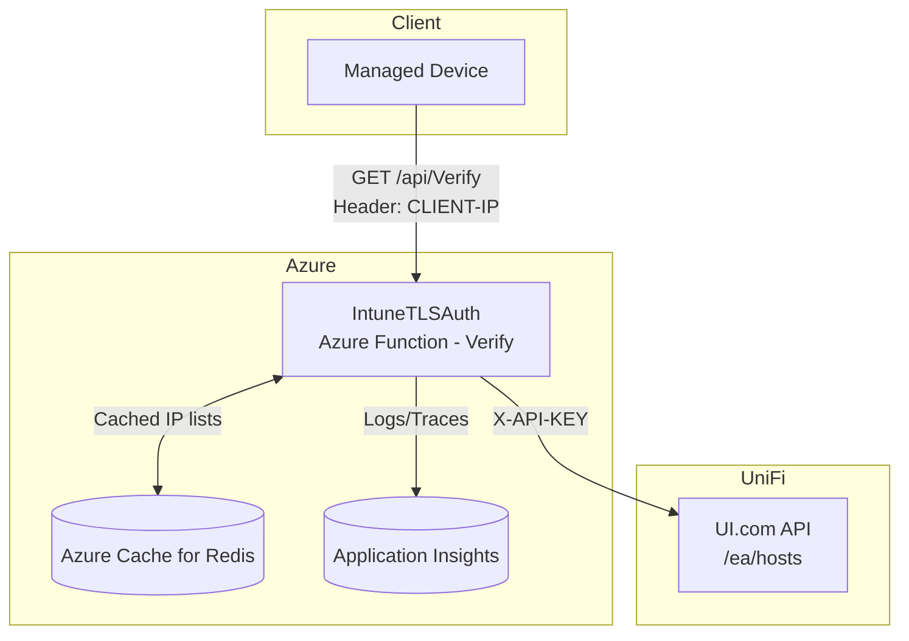
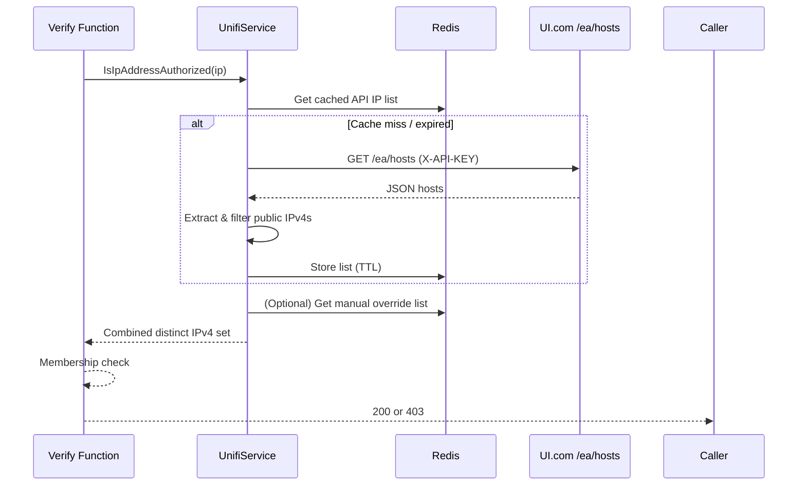

# IntuneTLSAuth

IntuneTLSAuth is an Azure Functions (isolated worker) application that supplies a lightweight “network trust” verification endpoint for Intune‑managed Windows devices.  
It validates the caller’s public IPv4 against a dynamically cached list sourced from the UniFi (UI.com) API. If the IP is recognized, the device (or agent script) can confidently switch to a “trusted / corporate” profile (e.g., apply a Private/Domain firewall profile or branch Intune remediation logic).

## Architecture



Data Flow:
1. Device (or diagnostic tool) calls `/api/Verify` supplying its public IP via the `CLIENT-IP` header (front door / gateway should inject this).
2. Function checks Redis for a cached authorized IP list. If stale/missing, it calls the UniFi API (`https://api.ui.com/ea/hosts` with `X-API-KEY = UNIFI_API_TOKEN`) to rebuild.
3. Returned hosts are parsed → public IPv4 set derived → cached.
4. The provided IP is checked against the combined (API + manual) set.
5. 200 (OK) on match, 403 otherwise.

## Production Endpoint: /api/Verify

| Method | Auth Level | Body | Headers Used | Success Response | Failure |
|--------|------------|------|--------------|------------------|---------|
| GET / POST | Anonymous (by design in code) | None | `CLIENT-IP: <public IPv4>` | 200 text/plain: `Authorization successful for <ip>` | 403 (no body) |

> [!WARNING]
> If the header `CLIENT-IP` is absent, a hardcoded fallback `1.1.1.1` is used purely for local testing; if that appears in production logs, treat it as a misconfiguration signal.
> This happens because Azure Functions Core Tools does not insert it on requests in local dev.

Minimal logic excerpt (for clarity only):
```csharp
var ipAddress = !string.IsNullOrEmpty(req.Headers["CLIENT-IP"])
    ? req.Headers["CLIENT-IP"].ToString()
    : "1.1.1.1"; // local dev fallback

ipAddress = ipAddress.Replace("\r", "").Replace("\n", "");
if (ipAddress.Contains(':'))
    ipAddress = ipAddress.Split(':')[0].Trim();

var isAuthorized = await unifiService.IsIpAddressAuthorized(ipAddress);
return isAuthorized
    ? new OkObjectResult($"Authorization successful for {ipAddress}")
    : new StatusCodeResult(403);
```

## UniFi Integration (Current Behavior)



Extraction Rules (summarized from `UnifiService`):
- Iterates host entries: collects candidate IPv4s from `ReportedState.wans[].ipv4` (and related fields).
- Filters to public IPv4 via `IsPublicIpv4` (excludes RFC1918, loopback, APIPA, multicast, etc.).
- If no public addresses are found, falls back to the raw collected set.
- Manual IPs (added via internal admin endpoints) are merged (distinct, case‑insensitive).

## Caching Strategy

| Item | Mechanism |
|------|-----------|
| Store | Azure Cache for Redis (Managed Identity auth) |
| Keys | `UnifiIpAddressList` (API derived), `UnifiManualIpAddressList` (manual entries) |
| Duration | `UNIFI_CACHE_DURATION_MINUTES` (default 5 if unset) |
| Refresh | Automatic on cache miss in `IsIpAddressAuthorized` or explicit (admin-only function not documented here) |

## Environment Variables (Implemented)

| Variable | Required | Description |
|----------|----------|-------------|
| `REDIS_CONNECTION_STRING` | Yes | Host/port string for Azure Cache for Redis. No keys; token auth (Managed Identity) is configured in code. |
| `UNIFI_API_TOKEN` | Yes | API key injected as `X-API-KEY` header to `https://api.ui.com/ea/hosts`. |
| `UNIFI_CACHE_DURATION_MINUTES` | No | Integer minutes for API IP list cache TTL (default 5). |
| `APPLICATIONINSIGHTS_CONNECTION_STRING` | Recommended | Directs telemetry to App Insights. |

Fail‑fast: Missing `REDIS_CONNECTION_STRING` → startup exception. Missing `UNIFI_API_TOKEN` → `InvalidOperationException` when constructing `UnifiService`.

## Response Semantics

| Scenario | HTTP | Body |
|----------|------|------|
| Authorized IP | 200 | `Authorization successful for <ip>` |
| Unauthorized IP | 403 | (empty) |
| Internal failure (e.g. API error not handled elsewhere) | 500 | Standard function error (improve with structured JSON if desired) |

## Example Client Call

```bash
curl -s -H "CLIENT-IP: 203.0.113.10" https://<function-app>.azurewebsites.net/api/Verify
# -> Authorization successful for 203.0.113.10  (or 403)
```

PowerShell (Intune remediation snippet example):
```powershell
$publicIp = (Invoke-RestMethod -Uri "https://ifconfig.me/ip").Trim()
$response = Invoke-WebRequest -Uri "https://<function-app>.azurewebsites.net/api/Verify" -Headers @{ "CLIENT-IP" = $publicIp } -UseBasicParsing -ErrorAction SilentlyContinue
if ($response.StatusCode -eq 200) {
    Write-Host "Trusted network"
    # Apply domain/private profile logic
} else {
    Write-Host "Untrusted network"
}
```

Adjust acquisition of the caller IP based on your environment; if edge injects header automatically, you may omit manual lookup.  
Intended usage via Windows Network Policy CSP is functional out of the box.

## Deployment (Condensed)

1. Create Azure Function App (Linux, .NET Isolated, Consumption or Premium).
2. Enable System-Assigned Managed Identity.
3. Provision Azure Cache for Redis (assign necessary access for Managed Identity).
4. Configure App Settings:
   - `REDIS_CONNECTION_STRING=<redis-hostname>:6380,ssl=True`
   - `UNIFI_API_TOKEN=<token>`
   - `UNIFI_CACHE_DURATION_MINUTES=5` (optional)
5. (Optional) Set `APPLICATIONINSIGHTS_CONNECTION_STRING`.
6. Deploy code (`func azure functionapp publish <name>` or CI workflow).

## Operational Notes

| Topic | Guidance |
|-------|----------|
| Cache Staleness | 5‑minute window default— adjust for balance between accuracy and API rate. |
| UniFi Outage | On API failure after cache expiry, decide on fail-open vs fail-closed; currently reliance on cache logic—document desired fallback if implemented. |
| Telemetry | Use Kusto queries on App Insights traces for success/403 ratios. |
| Manual Overrides | Supported via internal admin endpoints (intentionally excluded here). |
| Scale | Function is stateless; Redis centralizes ephemeral data → horizontal scale is safe and encouraged. |

## Contributing

1. Fork → branch (`feat/<short>`).
2. Keep docs strictly aligned with code (no speculative sections).
3. If adding config keys, update the Environment Variables table in the same PR.
4. Provide minimal unit / integration coverage for new parsing or filtering logic.
5. Submit PR with rationale and operational impact summary to this repo's `dev` branch.

## Verification Checklist

| Item | Status |
|------|--------|
| Startup succeeds (Redis + UniFi token present) | |
| `/api/Verify` returns 200 for known authorized IP | |
| `/api/Verify` returns 403 for unknown IP | |
| Cache refresh logs visible (first call after TTL) | |
| Application Insights receiving traces | |
| No unexpected use of fallback IP in logs | |
